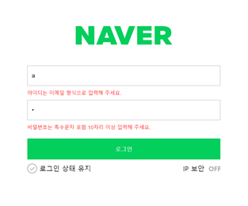
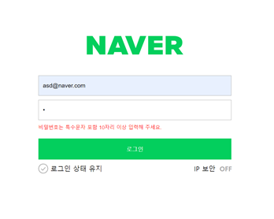

# 네이버 로그인 페이지 구현

## 구현

로그인과 비밀번호를 정확히 입력했을 때 welcome 페이지로 넘어갈 수 있도록 코드 로직을 작성합니다.
- [x] 아이디 입력, 비밀번호 정확하게 입력해서 버튼 클릭하면 웰컴 페이지로 넘어감
- [x] 아이디를 형식에 맞지 않게 쓰면 안내 문구
- [x] 비밀번호를 형식에 맞지 않게 쓰면 안내 문구

---

## 코드 설명

- login 함수 생성
- document.querySelector("#userEmail") // userEmail id를 통해 input 태그 전체를 가져와 InputId.value로 입력 값을 받는다.
  ```
  let InputId = document.querySelector("#userEmail");
  ```
  
- 부정 연산자를 사용하여 if의 조건식이 false일 때 명시된 클래스를 추가하는 classList 메서드 add를 사용하여 is--invalid 클래스를 추가, display를 block으로 설정, 문구가 보이도록 한다.
 ```
   if (!emailReg(InputId.value)) {
    InputId.classList.add("is--invalid");
  }
 ```

- 비교 연산자를 사용해 InputId.value 값과 user.id 값이 동일하고 InputPw.value 값과 user.pw 값이 동일할 때 welcome.html로 이동하도록 한다.
- 명시된 클래스를 제거하는 classList 메서드 remove를 사용하여 is--invalid 클래스를 삭제해 문구를 없앤다.
```
  if (InputId.value === user.id && InputPw.value === user.pw) {
    window.location.href = "welcome.html";
    InputId.classList.remove("is--invalid");
    InputPw.classList.remove("is--invalid");
  }
```
---
## 실행화면


아이디 불일치

비밀번호 불일치

로그인 성공
